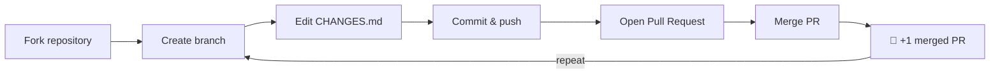
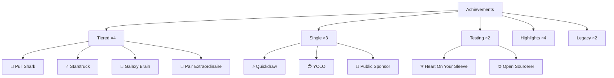

<p align="center">
  
</p>

<p align="center">
  <a href="https://github.com/Khan3K/pull-shark/stargazers"></a>
  <a href="https://github.com/Khan3K/pull-shark/network"></a>
  <a href="https://github.com/Khan3K/pull-shark/issues"></a>
  <a href="https://github.com/Khan3K/pull-shark/pulls"></a>
  <a href="https://github.com/Khan3K/pull-shark/commits/main"></a>
  <a href="https://github.com/Khan3K/pull-shark/blob/main/LICENSE"></a>
</p>

<p align="center">
  <a href="#practice-here-earn-pull-shark"></a>
  <a href="#every-badge-at-a-glance"></a>
  <a href="#how-to-earn-each-badge--detailed"></a>
  <a href="#troubleshooting-badge-not-showing"></a>
  <a href="#faq"></a>
</p>

<p align="center">
  
  
  
  
</p>

> 🚀 **TL;DR — Earn your first badge in ~2 minutes:** Fork this repo → edit `CHANGES.md` → open & merge a PR → 🦈 **Pull Shark (Default)** unlocks. Repeat to **16** for 🥉 Bronze.

---

## 🎨 Badge Gallery

<p align="center">
  
  
  
  
  
  
  
  
  
</p>

<p align="center">
  
  
  
  
</p>

<p align="center">
  
  
</p>

> 💡 **Every badge above is documented in detail below** — with image, tiers, status, step-by-step, tips and pitfalls.

---

## ✨ What Are GitHub Achievements?

**Achievements** are collectible badges on your GitHub profile (`github.com/<username>?tab=achievements`). They unlock **automatically** when you complete specific actions — merging pull requests, earning stars, answering discussions, sponsoring open source, co-authoring commits, and more.

| Feature | Details |
|---------|---------|
| **Where do they appear?** | Your public profile → Achievements tab (visible to everyone). |
| **Are they public?** | Yes by default. You can hide any achievement (see [⚙️ Show or Hide](#show-or-hide-achievements)). |
| **Do they expire?** | No. Once earned, they stay unless GitHub retires the badge. |
| ** tiers?** | 4 of them upgrade: Default → 🥉 Bronze (`x2`) → 🥈 Silver (`x3`) → 🥇 Gold (`x4`). |
| **Skin tones?** | Some achievements have 6 skin-tone variants based on your emoji preference. |
| **Highlights?** | Separate section under achievements (Pro, Developer Program, etc.). |

<p align="center">
  <a href="https://github.com/Khan3K/pull-shark/stargazers"></a>
  <a href="https://github.com/Khan3K/pull-shark/fork"></a>
</p>

---

## 📑 Table of Contents

- [✨ What Are GitHub Achievements?](#what-are-github-achievements)
- [🦈 Practice Here: Earn Pull Shark](#practice-here-earn-pull-shark)
- [📋 Every Badge at a Glance](#every-badge-at-a-glance)
- [📖 How to Earn Each Badge — Detailed](#how-to-earn-each-badge--detailed)
- [🥇 Tiered Achievements Deep Dive](#tiered-achievements-deep-dive)
- [🎨 Skin Tone Variants](#skin-tone-variants)
- [🏅 Profile Highlights — Detailed](#profile-highlights--detailed)
- [⛔ Legacy and Unobtainable — Story](#legacy-and-unobtainable--story)
- [⚙️ Show or Hide + Appearance](#show-or-hide--appearance)
- [🚨 Troubleshooting: Badge Not Showing?](#troubleshooting-badge-not-showing)
- [🛡️ README Badges (Shields) — Complete Guide](#readme-badges-shields--complete-guide)
- [💡 Tips to Earn Faster](#tips-to-earn-faster)
- [❓ FAQ](#faq)
- [🕰️ History & Changelog](#history--changelog)

<p align="center"></p>

---

## 🦈 Practice Here: Earn Pull Shark

This repository is a **safe, friendly place** to practice the pull-request workflow and earn **🦈 Pull Shark**. Every merged PR here counts toward your tier.

> 💡 **Goal of this repo:** reach **🥉 Bronze** by merging **16 pull requests**. You are already on your way with every PR you open here!

<table>
<tr>
<td width="60%">

### 7-Step Quick Start (Web UI)

1. **Fork** this repo → `Fork` button (top right).
2. `Create new file` or edit `CHANGES.md` on **your fork**.
3. **Commit** → choose *Create a new branch* → `Propose changes`.
4. **Open PR** → `Create pull request` → `Create pull request` again.
5. **Merge** it on your fork (or wait for maintainer to merge here).
6. Repeat steps 2–5.

**You need 2 merged PRs for the shark, 16 for Bronze!**

</td>
<td width="40%">

### 🪜 Pull Shark Ladder

> 🎯 **Track your progress** (check off as you earn each tier — see [⚙️ Show or Hide](#show-or-hide--appearance) to confirm on your profile):

- [ ] 🐣 **Default** — merge **2** pull requests
- [ ] 🥉 **Bronze** — merge **16** pull requests  ← _this repo's goal_
- [ ] 🥈 **Silver** — merge **128** pull requests
- [ ] 🥇 **Gold** — merge **1024** pull requests

| Tier | Needed | Label |
|------|--------|-------|
| 🐣 Default | **2** | `x1` |
| 🥉 Bronze | **16** | `x2` |
| 🥈 Silver | **128** | `x3` |
| 🥇 Gold | **1024** | `x4` |

```
🐣 2      ████░░░░░░░░░░░░░░░░
🥉 16     ████████░░░░░░░░░░░░  ← GOAL
🥈 128    ████████████████░░░░
🥇 1024   ████████████████████
```

> Tiers upgrade **automatically**.

</td>
</tr>
</table>

<details>
<summary>💻 Alternative: via CLI (git)</summary>

```bash
git clone https://github.com/<YOUR_USER>/pull-shark
cd pull-shark
git checkout -b my-pr-1
echo "my change 17" >> CHANGES.md
git add CHANGES.md && git commit -m "Add change 17"
git push origin my-pr-1
# then open PR on GitHub
```

</details>

<details>
<summary>🖥️ Alternative: via GitHub Desktop</summary>

1. `File → Clone repository → Khan3K/pull-shark`.
2. `Branch → New branch → my-pr-1`.
3. Edit `CHANGES.md`, commit.
4. `Push origin` → `Create Pull Request` → `Create` → `Merge`.

</details>

> ✅ **Pro Tip:** After forking, enable `Actions` on your fork to avoid warnings. Every merged PR counts even on your fork's `main`.

### 🔄 The Workflow (visual)



<p align="center"></p>

---

## 📋 Every Badge at a Glance

> Legend: ✅ Earnable · 🧪 In testing (may not be grantable) · ⚠️ Paused/limited · ❌ No longer earnable

| Badge | Preview | How to Earn | Tiers | Difficulty | Status |
|-------|---------|-------------|-------|------------|--------|
| 🦈 **Pull Shark** |  | Merge at least **2 pull requests** | 4 | 🟡 Medium | ✅ |
| ⭐ **Starstruck** |  | A repo you own reaches **16 stars** | 4 | 🔴 Hard | ✅ |
| 🧠 **Galaxy Brain** |  | **2 answers accepted** in Discussions | 4 | 🟡 Medium | ⚠️ |
| 👥 **Pair Extraordinaire** |  | **Co-author a commit** in a merged PR | 4 | 🔴 Hard | ✅ |
| ⚡ **Quickdraw** |  | Close an issue/PR **within 5 min** | — | 🟢 Very Easy | ✅ |
| 😎 **YOLO** |  | Merge a PR **without review** | — | 🟢 Easy | ✅ |
| 💖 **Public Sponsor** |  | **Publicly sponsor** via [Sponsors](https://github.com/sponsors) | — | 🟢 Very Easy | ✅ |
| 💗 **Heart On Your Sleeve** |  | React with ❤️ on GitHub | — | 🟢 Very Easy | 🧪 |
| 🌐 **Open Sourcerer** |  | PRs merged in **>1 public repo** | — | 🟡 Medium | 🧪 |

**Highlights:** Pro · Developer Program Member · Security Bug Bounty Hunter · Discussion Answered
**Legacy:** Arctic Code Vault Contributor · Mars 2020 Contributor

> 💗 & 🌐 are experimental — GitHub may change/disable them at any time.
> 🧠 Galaxy Brain awarding via Community Discussions has been **paused** by GitHub.

### 🗺️ Badge Map (visual)



<p align="center"></p>

---

## 📖 How to Earn Each Badge — Detailed

Expand any badge for requirements, tiers, time estimate, full steps, common pitfalls and pro tips.

<details>
<summary>🦈 Pull Shark — merge pull requests · <b>✅ Earnable</b> · 4 tiers</summary>

**Quick info**

| Field | Value |
|-------|-------|
| **Earned by** | Merging pull requests (yours or others, any public repo). |
| **Minimum** | 2 merged PRs → 🐣 Default |
| **Tiers** | 2 → 16 (🥉) → 128 (🥈) → 1024 (🥇) |
| **Time** | Minutes (use this repo). |
| **Applies to** | Only merged PRs count. Closed without merge does not count. Draft PRs don't count until ready + merged. |

**Full steps**

1. Open a **public** repository (this one is perfect).
2. Create a **new branch** (`my-pr-17`).
3. Edit any file (e.g., add a line to `CHANGES.md`).
4. Commit with a clear message.
5. `Push` branch → `Compare & pull request` → `Create pull request`.
6. **Merge** it (on your fork you can merge yourself; here a maintainer merges).
7. Repeat. Check `https://github.com/<you>?tab=achievements` after a few minutes.

**Tips**

- Merge **2 PRs in one sitting** to unlock instantly.
- Pair with **YOLO** (merge without review) and **Quickdraw** (within 5 min) to get 3 badges at once.

**Pitfalls**

- Private repo PRs may not count as reliably — use public repos.
- Squash-merged PRs still count; the PR itself must be marked `Merged`.

</details>

<details>
<summary>⭐ Starstruck — get stars · <b>✅ Earnable</b> · 4 tiers · 🔴 Hard</summary>

| Field | Value |
|-------|-------|
| **Earned by** | Owning a repo that reaches 16 stars. |
| **Tiers** | 16 → 128 → 512 → 4096 ⭐ |
| **Time** | Days → months (depends on promotion). |

**Full steps**

1. Create a **useful public repo** — tool, template, awesome list, notes, or guide (this badges guide is a good example!).
2. Write a killer `README.md`: what it does, screenshots/GIF, usage, install, examples.
3. Add topics (`Add topics` on repo), a social preview image, and a license.
4. Share on Reddit, DEV.to, Twitter/X, Product Hunt, Discord.
5. Ask for stars — in docs, tweets, and the repo header.
6. Keep updating — stars grow with usefulness.

**Tips**

- ⭐ is the hardest badge — quality + marketing matters. A "useful list" beats a throwaway repo.
- Your profile's **Pinned** repos get more visibility — pin your star candidate.

**Pitfalls**

- Stars from bots/suspicious accounts may be discounted. Organic stars are what matters.

</details>

<details>
<summary>🧠 Galaxy Brain — accepted answers · <b>⚠️ Paused</b> · 4 tiers</summary>

| Field | Value |
|-------|-------|
| **Earned by** | Getting answers marked as accepted in [GitHub Discussions](https://github.com/orgs/community/discussions/) or Q&A discussions in repos. |
| **Tiers** | 2 → 8 → 16 → 32 accepted answers |
| **Current state** | GitHub has **paused** awarding via Community Discussions (see [discussion 106536](https://github.com/orgs/community/discussions/106536)). May return. |

**Steps (when active)**

1. Go to [GitHub Community Discussions](https://github.com/orgs/community/discussions/) or any repo with **Discussions → Q&A** enabled.
2. Filter `answered: false`, find questions you can answer well.
3. Post a clear, formatted answer with code blocks and context.
4. Get 2 marked as *Answer* by the asker.

**Tips**

- Answer **unanswered** questions in repos you know (React, Python, etc.) — acceptance rate is higher.

**Pitfall:** Do not spam or copy answers — low-quality accepted answers may be reverted and the badge is paused anyway.

</details>

<details>
<summary>👥 Pair Extraordinaire — co-authored commit · <b>✅ Earnable</b> · 4 tiers · 🔴 Hard</summary>

| Field | Value |
|-------|-------|
| **Earned by** | Having a commit with a `Co-authored-by:` trailer merged via a PR. |
| **Tiers** | 1 → 10 → 24 → 48 co-authored merged PRs |

**Full steps**

1. Create a PR (any repo, public or private).
2. In the commit message, add on a new line: `Co-authored-by: Friend Name <friend@email.com>` — the email **must** match a GitHub account.
3. Push → open PR → merge it.

Easiest with **GitHub Desktop**: `History → right-click commit → Add co-author`.

Or via CLI:

```bash
git commit -m "Add feature

Co-authored-by: Jane Doe <jane@users.noreply.github.com>"
```

4. Merge the PR.

**Tips**

- You can co-author with yourself (second email) — accounts must both exist.
- Each *commit* counts; one PR with multiple co-authored commits does not multiply tiers faster than multiple PRs.

</details>

<details>
<summary>⚡ Quickdraw — close within 5 minutes · <b>✅ Earnable</b></summary>

| Field | Value |
|-------|-------|
| **Earned by** | Closing an issue or PR **within 5 minutes** of opening it. |
| **No tiers** | One-time unlock. |

**Steps**

1. Open an issue or PR (use this repo's Issues → `New issue`).
2. Wait 10–30 seconds.
3. Click `Close issue` / `Close pull request` **within 5:00**. Use a timer if needed.

**Tips:** Do it on your fork so you don't spam the main repo. Works on your own repos where you can close immediately.

**Pitfall:** Closing after 5:01 does not count — speed matters.

</details>

<details>
<summary>😎 YOLO — merge without review · <b>✅ Earnable</b></summary>

| Field | Value |
|-------|-------|
| **Earned by** | Merging a PR **with zero reviews or review comments**. |
| **No tiers** | |

**Steps**

1. Create a PR on a repo **you own** (your fork) with branch protection **not** requiring reviews.
2. Do **not** request a review.
3. Click `Merge pull request` straight away.

**Tips:** Pair with **Pull Shark** — every YOLO merge also counts for Pull Shark.

**Pitfall:** If a review is required by branch protection, you cannot YOLO — disable "Require pull request reviews" in `Settings → Branches` on your fork.

</details>

<details>
<summary>💖 Public Sponsor — sponsor open source · <b>✅ Earnable</b></summary>

| Field | Value |
|-------|-------|
| **Earned by** | Sponsoring an open source contributor/org via [GitHub Sponsors](https://github.com/sponsors) with visibility = **Public**. |
| **Cost** | As low as $1/month. |

**Steps**

1. Go to https://github.com/sponsors → pick anyone (e.g., search a maintainer you like).
2. `Sponsor` → choose tier → pay.
3. Ensure it is **not** set to private (check `Sponsors → Manage → Visibility`).

**Tip:** You keep the badge as long as you have at least one public sponsorship active.

</details>

<details>
<summary>💗 Heart On Your Sleeve — ❤️ reaction · <b>🧪 Testing</b></summary>

| Field | Value |
|-------|-------|
| **Earned by** | Reacting to something on GitHub with a ❤️ emoji. |
| **Status** | Experimental — may appear/disappear from profiles, not reliably grantable. |

**Steps** (when live): open any issue/comment/discussion → click `😊 React` → `❤️`.

**Note:** GitHub has been A/B testing this since 2022. Don't rely on it.

</details>

<details>
<summary>🌐 Open Sourcerer — many repos · <b>🧪 Testing</b></summary>

| Field | Value |
|-------|-------|
| **Earned by** | Having PRs merged in **multiple public repositories** you don't own. |
| **Status** | Experimental — not reliably grantable. |

**Steps** (when live): Contribute small fixes to 2+ popular open source repos and get PRs merged.

</details>

<p align="center"></p>

---

## 🥇 Tiered Achievements Deep Dive

Four achievements upgrade through **x2 (Bronze), x3 (Silver), x4 (Gold)**. Each tier has a label color.

| Tier | Label | Hex | Visual |
|------|-------|-----|--------|
| 🥉 Bronze | `x2` | `#F9BFA7` |  |
| 🥈 Silver | `x3` | `#E1E4E4` |  |
| 🥇 Gold | `x4` | `#FAE57E` |  |

| Achievement | 🐣 Default | 🥉 Bronze | 🥈 Silver | 🥇 Gold |
|-------------|-----------|-----------|-----------|---------|
| 🦈 Pull Shark | 2 PRs | 16 PRs | 128 PRs | 1024 PRs |
| ⭐ Starstruck | 16 ⭐ | 128 ⭐ | 512 ⭐ | 4096 ⭐ |
| 🧠 Galaxy Brain | 2 answers | 8 answers | 16 answers | 32 answers |
| 👥 Pair Extraordinaire | 1 commit | 10 commits | 24 commits | 48 commits |

> 💡 **This repo** is purpose-built to grind the **Pull Shark** ladder — merge PRs to climb from 🐣 to 🥇.

<p align="center"></p>

---

## 🎨 Skin Tone Variants

GitHub lets you change your **emoji skin tone preference** — it affects some achievements that contain hand/figure emoji.

| Skin tone | Example (✌️) | How to change |
|-----------|--------------|---------------|
| Default | ✌️ | Settings → Appearance → *Emoji skin tone preference* |
| Light | ✌🏻 | ↑ same |
| Medium-Light | ✌🏼 | ↑ same |
| Medium | ✌🏽 | ↑ same |
| Medium-Dark | ✌🏾 | ↑ same |
| Dark | ✌🏿 | ↑ same |

- Applies to: achievements whose artwork contains hands/people — e.g., Pull Shark, Quickdraw, Pair Extraordinaire.
- To test: change the preference, refresh your achievements page (`github.com/<you>?tab=achievements`), and hover the badge.

<p align="center"></p>

---

## 🏅 Profile Highlights — Detailed

Separate from achievements, shown under the **Highlights** card on your profile.

| Highlight | Icon | How to Earn | Notes |
|-----------|------|-------------|-------|
| **Pro** | 💼 | Subscribe to [GitHub Pro](https://docs.github.com/en/get-started/learning-about-github/githubs-products) (paid). | Shows while subscription is active. |
| **Developer Program Member** | 🧑‍💻 | Join the [GitHub Developer Program](https://docs.github.com/developers/overview/github-developer-program). | Free, instant. |
| **Security Bug Bounty Hunter** | 🔒 | Have a report accepted via the [GitHub Bug Bounty](https://bounty.github.com/). | Must be validated by GitHub Security. |
| **Arctic Code Vault Contributor** | 🧊 | Already covered under legacy (also appears as highlight for some). | Historical. |
| **Discussion Answered** | 💬 | Have a reply marked as the accepted answer in a Q&A discussion. | Works in any repo with Discussions → Q&A enabled. |

> **Want all highlights?** Pro is paid; the others are free. Developer Program is the easiest — one-click join.

<p align="center"></p>

---

## ⛔ Legacy and Unobtainable — Story

These were awarded for one-time historical events and **can no longer be earned**:

| Badge | Preview | How It Was Earned | Date |
|-------|---------|-------------------|------|
| **Arctic Code Vault Contributor** |  | Contributed code archived in the 2020 [GitHub Archive Program](https://archiveprogram.github.com/) (stored in Arctic World Archive, Svalbard). | Feb 2020 |
| **Mars 2020 Contributor** |  | Contributed code used in NASA's [Mars 2020 Helicopter Mission (Ingenuity)](https://github.com/readme/featured/nasa-ingenuity-helicopter). | Apr 2021 |

They remain visible on profiles of those who earned them — a permanent piece of GitHub history.

<p align="center"></p>

---

## ⚙️ Show or Hide + Appearance

### Hide achievements on your profile

1. Click your **profile photo** (top-right) → **Settings**.
2. In the left sidebar → **Public profile**.
3. Scroll to **Achievements and highlights** → uncheck the ones you don't want to show.
4. Click **Save**.

Direct link: https://github.com/settings → *Profile*.

### Change emoji skin tone

1. **Settings** → **Appearance**.
2. Scroll to **Emoji skin tone preference**.
3. Choose from 6 tones → applies instantly to achievements & emoji site-wide.

### Achievement optics (light vs dark)

Achievements render slightly different in **light** and **dark** mode — check both via your GitHub appearance settings or by appending `?tab=achievements` and toggling the theme on that page.

<p align="center"></p>

---

## 🚨 Troubleshooting: Badge Not Showing?

| Problem | Fix |
|---------|-----|
| **Merged PR but no Pull Shark** | Wait 10–60 min (GitHub batches achievements). Ensure the repo is **public** and the PR is marked `Merged` (not just `Closed`). |
| **YOLO not unlocking** | There must be **zero** reviews: no approval, no `comment`, no `request changes`. Check `Conversation` tab has no review entries. |
| **Quickdraw not unlocking** | Must be **≤ 5:00** from creation to closure. Use a stopwatch. |
| **Galaxy Brain not unlocking** | GitHub has **paused** this badge. It may not be earnable currently — wait for re-enable. |
| **Starstruck not unlocking** | Stars are tallied per-repo; wait a few minutes. Bot stars don't count. |
| **Pair Extraordinaire not unlocking** | Ensure email in `Co-authored-by:` matches a GitHub account's **verified** email exactly. |
| **Nothing appears** | Go to `Settings → Public profile` and ensure **Show achievements** is checked. Also check you are looking at `?tab=achievements`, not `?tab=overview`. |
| **Still missing after 24h** | Open a discussion at https://github.com/orgs/community/discussions — GitHub staff occasionally fix stuck badges. |

<p align="center"></p>

---

## 🛡️ README Badges (Shields) — Complete Guide

**README badges** (shields) are SVG images showing repository metadata. They make any project look polished — and help attract stars for Starstruck!

### Live Preview — Badges from this repo

| Badge | Markdown | Preview |
|-------|----------|---------|
| Stars | `https://img.shields.io/github/stars/Khan3K/pull-shark?style=social` |  |
| Forks | `…/forks/…?style=social` |  |
| Issues | `…/issues/Khan3K/pull-shark` |  |
| PRs | `…/issues-pr/Khan3K/pull-shark` |  |
| Last commit | `…/last-commit/Khan3K/pull-shark` |  |
| License | `…/license/Khan3K/pull-shark` |  |
| Repo size | `…/repo-size/Khan3K/pull-shark` |  |

### Services

| Service | URL |
|---------|-----|
| **Shields.io** | https://shields.io — the standard |
| **Badgen.net** | https://badgen.net — alternative |

### Common Examples

**Repository stats**
```markdown


```

**Build & CI**
```markdown


```

**Version & License**
```markdown


```

**Dynamic (auto-updates)**
```markdown


```

### Custom Badge Format
```
https://img.shields.io/badge/<LABEL>-<MESSAGE>-<COLOR>
```
Example: `https://img.shields.io/badge/status-active-brightgreen` → 

### Colors

| Color | Code | Preview |
|-------|------|---------|
| Bright Green | `brightgreen` |  |
| Green | `green` |  |
| Yellow | `yellow` |  |
| Orange | `orange` |  |
| Red | `red` |  |
| Blue | `blue` |  |
| Light Grey | `lightgrey` |  |
| Grey | `grey` |  |
| Hex | `ff69b4` |  |

### Styles & Logos
- **Styles:** append `?style=` → `flat` (default), `flat-square`, `for-the-badge`, `social`, `plastic`
- **Logos:** append `&logo=<name>` (e.g., `github`, `python`, `javascript`, `npm`, `docker`)

```markdown


```

Try live: `https://img.shields.io/badge/Python-3.11-blue?logo=python&style=for-the-badge`

### Placement Tips
- Group related badges (build, tests, coverage) together.
- Put badges at the **top** of the README.
- Use **consistent styling** across all badges.
- 5–8 badges is usually enough — don't overload.
- Test every URL (broken shields show a 404 image).

<details>
<summary>📋 Copy-paste README badge block</summary>

```markdown
# My Project

[](https://github.com/Khan3K/pull-shark/stargazers)
[](https://github.com/Khan3K/pull-shark/network)
[](https://github.com/Khan3K/pull-shark/blob/main/LICENSE)
[](https://github.com/Khan3K/pull-shark/issues)


```

</details>

<p align="center"></p>

---

## 💡 Tips to Earn Faster

- ✅ **Pull Shark + YOLO:** Merge unreviewed PRs on your own fork — get **both** in one merge.
- ✅ **Pull Shark + Quickdraw:** Open a PR and merge it within **5 minutes** — again, two badges in one action. This is the fastest combo.
- ✅ **Use a dedicated practice repo** (like this one) — no fear of spamming real projects.
- ✅ **Craft a star-worthy repo** — a useful list/template with a great README beats spam repos for **Starstruck**. Quality > quantity.
- ✅ **Be active in Discussions** — helpful answers get accepted (for Highlights → Discussion Answered & potentially Galaxy Brain when it returns).
- ✅ **Sponsor once, get Public Sponsor instantly** — pick a maintainer you already follow.
- ✅ **Pair Extraordinaire trick:** On a single PR, amend and force-push a co-authored commit if you forgot the trailer initially — still counts once merged.

---

## ❓ FAQ

<details>
<summary>How long until a badge appears after I earn it?</summary>

Most badges appear within **10–60 minutes**; sometimes up to **24 hours** during GitHub batching delays. Check `github.com/<you>?tab=achievements`.

</details>

<details>
<summary>Do I need to use GitHub Desktop for Pair Extraordinaire?</summary>

No — you can do it via CLI or web by adding `Co-authored-by: Name <email>` to the commit message. But GitHub Desktop has a one-click UI for it.

</details>

<details>
<summary>Can I earn YOLO on someone else's repo?</summary>

Only if that repo has **no review requirement**. Most maintained repos require reviews, so the easiest is **your own fork** with branch protection disabled.

</details>

<details>
<summary>Can I earn Starstruck without sharing anywhere?</summary>

Technically yes (if 16 people organically find it), but practically you need to **share** it — social media, communities, awesome lists.

</details>

<details>
<summary>Are the heart/open-sourcerer badges real?</summary>

They are **real but experimental** (🧪). GitHub has A/B tested them; they may not be grantable at the moment. Treat them as bonus.

</details>

<details>
<summary>Can I hide a badge I already earned?</summary>

Yes — `Settings → Public profile → Achievements and highlights` → uncheck any achievement or highlight.

</details>

<details>
<summary>Will tiers reset if I delete repos/PRs?</summary>

No — tier progress is based on **historical events**. Deleting a repo does not remove the already-counted action (but don't rely on deleting as a strategy).

</details>

<p align="center"></p>

---

## 🕰️ History & Changelog

| Date | What changed |
|------|--------------|
| **Apr 2021** | Achievements launched with Mars 2020 & Arctic Code Vault. |
| **Jun 2022** | Added Pull Shark, Starstruck, Galaxy Brain, Pair Extraordinaire, Quickdraw, YOLO, Public Sponsor. |
| **2022–2023** | Introduced tier upgrades (Bronze/Silver/Gold) for 4 achievements. |
| **2023+** | Experimental badges: Heart On Your Sleeve, Open Sourcerer (A/B testing). |
| **2024–2025** | Galaxy Brain awarding paused via Community Discussions. |
| **Aug 2026** | This guide last verified — tier thresholds and statuses re-checked. |

---

<p align="center">
  <sub>Not affiliated with GitHub, Inc. — a community resource covering every GitHub badge and the 🦈 Pull Shark achievement.</sub>
</p>

---

## 🤝 Contributing

Found a missing badge, a wrong threshold, or a typo? **Pull Requests are welcome — and they also help you earn 🦈 Pull Shark!**

1. **Fork** this repo and create a branch (`git checkout -b fix/readme`).
2. Edit `README.md` — keep the structure, tables, and the `assets/` images.
3. **Open a PR** and get it merged.

Please keep the guide accurate and friendly. 💙

## 📜 License

Released under the [MIT License](LICENSE) — free to reuse, adapt, and share.

<p align="center"></p>

<p align="center">
  
  
  
</p>

<p align="center"><a href="#what-are-github-achievements">▲ Back to Top</a></p>
